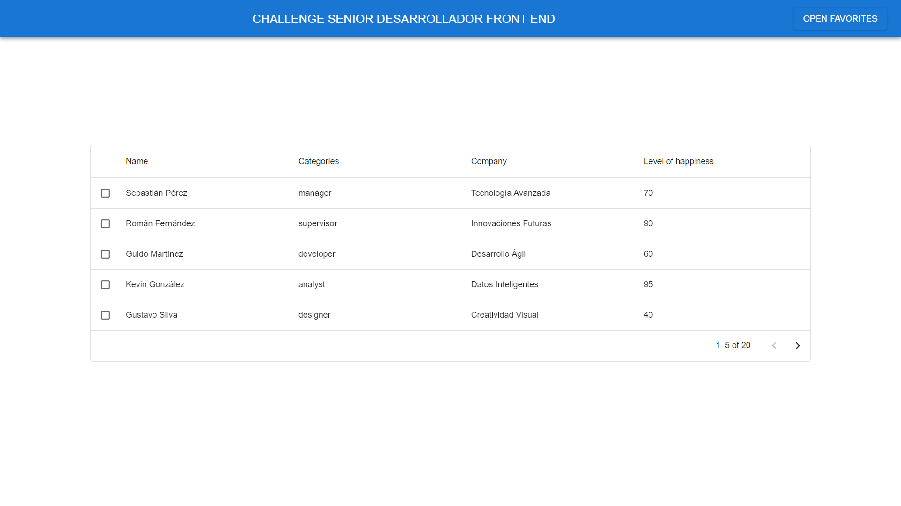
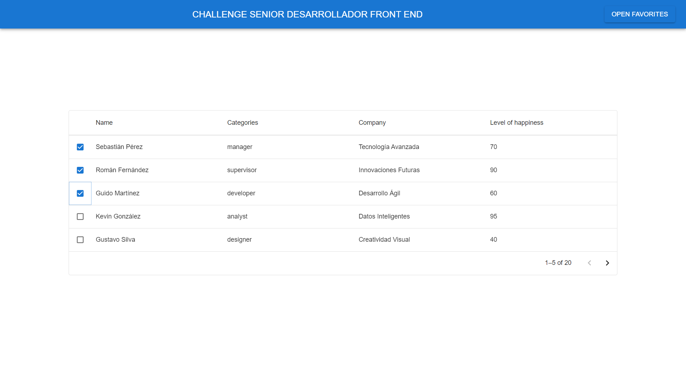
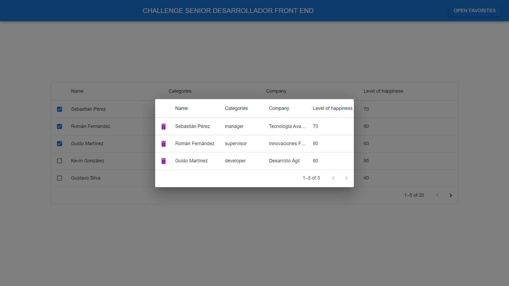
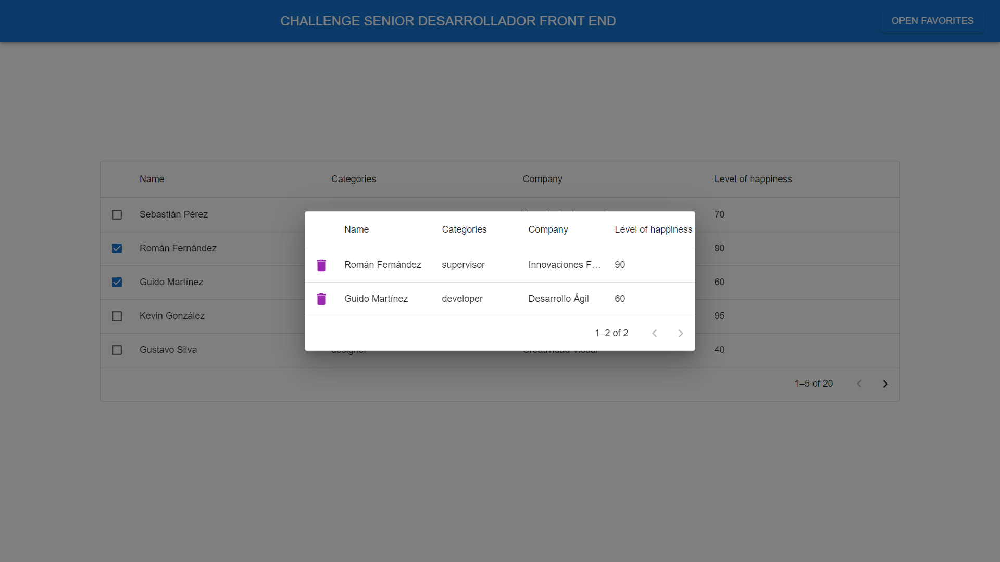

# Challenge técnico  
Se realiza un challenge técnico para el puesto de Desarrollador Front End Senior para una empresa alemana.

## Como ejecutar la solución.
Una vez clonado el repositorio ejecutar:
- pnpm install
- pnpm dev

## Consigna 
Acerca de esta prueba:

Queremos evaluar su capacidad para desarrollar una aplicación de una sola página moderna y funcional. A continuación, encontrará una lista de requisitos y puntos clave que debe tener en cuenta durante el desarrollo.

¡Que empiecen los juegos de desarrollo!

### Toma en consideración:

- Todas las bibliotecas y/o marcos de JavaScript están a su disposición.
- Solo para los navegadores más recientes.
- Utiliza TypeScript y ES6.
- Le recomendamos que utilice SCSS.

### Puntos extra:

- Calidad del código.
- Soporte móvil.
- Estructura de la aplicación.
- Unit Test.
- Experiencia de usuario.
- Optimización (tiempos de carga y rendimiento de renderizado).

### Herramienta de seguimiento de la felicidad del empleado (HSFE)

Para acelerar las cosas, le presentamos la **Herramienta de seguimiento de la felicidad del empleado** o HSFE.

HSFE es una aplicación que ayuda al usuario a realizar un seguimiento del nivel de felicidad de las personas relacionadas con su empresa. Cada persona tendrá las siguientes propiedades:

- Nombre
- Categoría (Empleado o Gerente)
- Nombre de empresa
- Nivel de felicidad

### Funcionalidades requeridas:

- Enumeración de personas con capacidad de búsqueda por nombre o categoría.
- Ordenamiento de resultados por nivel de felicidad, categoría o empresa en orden ascendente o descendente.
- Lista de favoritos con capacidad de búsqueda por nombre, categoría y empresa, y posibilidad de eliminar personas sin cerrar el modal.
- Recomendación de mostrar la lista de favoritos dentro de un modal accesible mediante la barra de navegación.
- Uso de paginación para los listados, mostrando 5 personas a la vez.

### Requisitos de entrega:

- Puede utilizar cualquier estrategia para almacenar la lista de favoritos (no se requiere persistencia).
- Adjunte su solución en un solo archivo zip o proporciónela mediante un repositorio privado de git.
- La solución debe ejecutarse correctamente y debe proporcionar un archivo de texto con las instrucciones necesarias para compilarla y/o ejecutarla.

### Entrega adicional (opcional):

- Se valorará cualquier mejora de UX/UI que desarrolle.
- Comente qué haría diferente si tuviera más tiempo o si no pudiera completar el ejercicio.

¡Buena suerte y que el código te acompañe!

## Posibles mejoras
Realizar testing, mejorar diseño agregar un tema con material.

